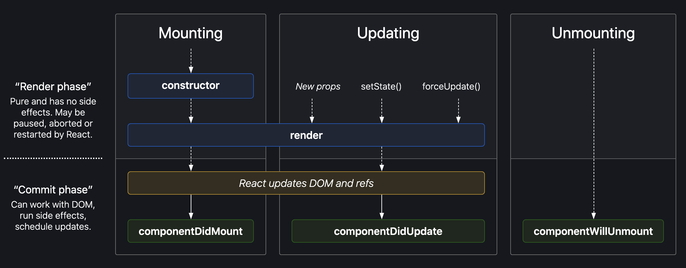

# The React Lifecycle
🌑🌒🌓🌔🌕

## Objectives
* describe the three phases of the React Component Lifecycle (mounting, updating, unmounting)
* properly explain what the `constructor` and `render` methods do, and what their place is in the React Component Lifecycle
* use the componentDidMount function to set a component's state post-render
* understand the order in which components render and "mount"
* bring it all together: use class components and their lifecycle methods to:
  * fetch data asynchronously from an external API (we'll use axios)
  * render the data to your app's UI
  * update the UI when state changes

## Review: Class Components

Here's the basic format you'll use when writing class components in React:

```javascript
class Lambda extends React.Component {
  constructor() {
    super(); // calls the constructor from React.Component, which intializes this.props
    // initialize this.state here
  }
  
  // lifecycle methods: componentDidMount, componentDidUpdate, componentWillUnmount, etc.
  
  render() {
    return <h1>Hello, {this.props.name}</h1>;
  }
}

export default Lambda;
```

## What are lifecycle methods? 

This may feel a bit complex at first, especially coming from the more streamlined Hooks approach. An easy way to understand the React lifecycle is that it's simply “when a component does what it does, and why". 

Just like a 🌿 or 🦔, a React component has three phases to its "lifecycle", and different things need to happen at each stage of life:
* 🐛 Birth / mounting (`componentDidMount`)
* 🦋 Growth / updating (`componentDidUpdate`)
* 💀 Death / unmounting (`componentWillUnmount`)

Sometimes they even render child components 🐣 too! But I may be overextending a questionable metaphor. Moving on...

## render()
If you were to implement the same component as a function and as a class, the JSX returned from `render()` is the same as what you return from the function component itself. 

Should be a pure function, meaning that it:
* does not modify component state 
* returns the same result each time it’s invoked
* does not directly interact with the browser.

## constructor()
For React class components, constructors are only used for two purposes:
* Initializing local state by assigning an object to `this.state`
* Binding event handler methods to an instance.

If you don’t initialize state and you don’t bind methods, you don’t need to implement a constructor for your React component. Remember that the `super()` call will happen even if you don't write a constructor.

For initialization, in the constructor we assign `this.state` directly. This is the only place we ever do this! In all other methods, use `this.setState()`. 

## Common lifecycle methods



Together, these three lifecycle methods are equivalent to the `useEffect()` hook. Let's look at them in detail:

### `componentDidMount`
invoked after React inserts the component into the DOM. Used to set a component’s state post-render

### `componentDidUpdate`
Takes arguments prevProps and prevState, and is called immediately after render is finished in each of re-render cycle. Use this for side effects like ajax reqeusts.

You should always add an if statement to make sure the relevant state/props have actually changed before doing anything here. (Otherwise you'll end up with infinite loops!)

### `componentWillUnmount`
perform any cleanup, e.g, removing event listeners, invalidating timers or cleaning up any DOM elements that were created in `componentDidMount` and `componentDidUpdate`

Use these to setup listeners, fetching data from an API and ultimately removing listeners before component is removed ("unmounted") from the DOM.

## In what order do components render and "mount" in a React component tree? 
So if you have a bunch of React components, the parent component at the top of the tree renders and "mounts" first, right?

Not quite! You may be surprised to learn that it actually happens like this:
* Parent component renders, recursively rendering all of the child components down the tree
* The **child component at the bottom of the tree mounts first**!
* Then the "mounting" propogates back **up** the tree
* Finally, the parent component at the top of the tree mounts last.

I like to visualize this initialization process as a "down-up" motion, all happening in the blink of an eye in most cases. So any `componentDidMount` or `useEffect` methods toward the top of the tree will actually be called *after* all the children components have mounted.

This can present a very sneaky bug when you expect data to have been passed down to a child component but it's undefined becuase the parents haven't mounted yet! When a child component renders for the first time, **none of its parent components have mounted yet**. This means that we can't count on anything from their lifecycle methods being defined yet. This is why we initialize with empty strings and other placeholders in the constructor, to make sure child components don't ever receive `undefined` values for their props. When someday you inevitably come across a mystical-sounding error like this: 😿🚳 `Uncaught TypeError: Cannot call method 'map' of undefined` 😿🚳, checking for undefined props due to this specific render/mount order in React should be your first line of defense. 

To prevent these type errors that randomly crash your app, think about how props will change throughout the lifecycle of your components and build in some safety checks to avoid accessing values that aren't yet defined. Especially when there are maps and other type-specific methods involved. (Better yet, encourage your team to start using TypeScript! It's easy to learn, can be added to existing projects incrementally without any heavy lifting, and specifically helps prevent errors like this.)

Check out the "React Call Order" article below for a great intro to this advanced concept with some helpful diagrams to explain this "down then back up" render and mount order. Understanding this order of operations will save you many hours of debugging the sneakiest bugs in the future!

## Rarely used lifecycle methods 🦖🦕📻📺
* getDerivedStateFromProps
* shouldComponentUpdate
* getSnapshotBeforeUpdate

And some others that are deprecated now. Focus on just getting really comfortable with the 3 above, as you'll mainly just see those in most cases. If you're curious for more historical context though, feel free to dig into the React.Component API reference linked below.

## Understanding function components vs class components:
One simplified way to understand these different styles is that the `return` of a function component is the same as what we return from the `render()` method within a class component. In class components we manage state and side effects with these specifically named lifecycle methods, while in a function component we use hooks like useState() and useEffect() to do the same thing.

## More Resources

### Videos
[Codevolution - Component Mounting Lifecycle Methods](https://www.youtube.com/watch?v=KDXZibVdiEI&ab_channel=Codevolution)

[Tiff in Tech - React Lifecycle Explained](https://www.youtube.com/watch?v=deMOuGlpOso&ab_channel=TiffInTech)

[React 16 For Everyone #6 - LifeCycle Methods](https://www.youtube.com/watch?v=9kSXwj_K-6o&ab_channel=LevelUpTuts)

### Articles

[useEffect explained with lifecycle methods](https://dev.to/prototyp/react-useeffect-explained-with-lifecycle-methods-296n)

[Understanding the useEffect Dependency Array](https://medium.com/better-programming/understanding-the-useeffect-dependency-array-2913da504c44)

[React.Component lifecycle methods - API reference](https://reactjs.org/docs/react-component.html) 

[Interactive lifecycle method diagram](https://projects.wojtekmaj.pl/react-lifecycle-methods-diagram/)

[React Call Order](https://blog.logrocket.com/post-hooks-guide-react-call-order/)

[React component’s lifecycle - Medium article](https://medium.com/react-ecosystem/react-components-lifecycle-ce09239010df)

[Lifecycle Methods & Side Effects - by TL Megan Miller](https://www.notion.so/React-b4e93c23ea164f08a54622c3f6b40912?p=f37ae29e99564a89be8b0918c02ef974)

[this - by TL Megan Miller](https://www.notion.so/this-a82f4b18e0ba427b8e38e6b86daf645c)


