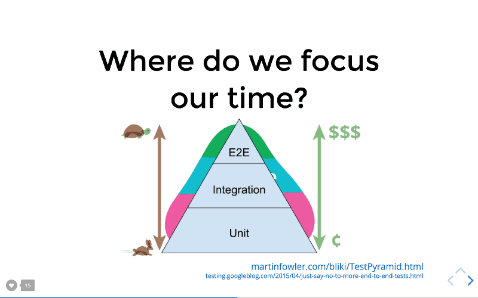

# Testing Web Applications
⚛️👩‍🔬🧪🧬

## Why Test? 
* Having a comprehensive test suite allows us to trust the code
* Safety net for future changes & refactoring (especially helpful for team collaboration)
* Bugs will immediately be surfaced in the future
* Encourages modular, easy-to understand-code (tangled code is also often difficult to test!)
* Helpful in quality control and deployment
* Tests also act as a form of documentation and enforces best practices
* ...and many other reasons. (*Not testing* is a bad idea, like taking out a high-interest loan of technical debt)


## Why not just QA manually?
For a small app it's easy to just run through some test cases in the browser before shipping a new feature. But what if your app has hundreds of thousands of lines of code? The manual approach quickly gets unmanageable at scale, and it's easy to unexpectedly (and invisibly) break a legacy feature when you go live with something new. 

While it's impossible to comprehensively test your app top to bottom every time you push some new code with the manual QA approach, it's easy to do exactly that with a thoughtful automated test suite.

## Four Kinds of Tests
There's a lot of different terminology floating around, and sometimes the categories overlap but here's a relatively easy way to understand the main categories of automated tests. (Kent C. Dodds explains ths really nicely -- check out his article and pdf's below!)

* 🌲 **End to End testing:** simulating an entire user flow from start to finish. If you're writing an e-commerce app, that flow could be placing items in the cart and completing a purchase. You've seen this kind of testing before with **Enzyme**
* 🌿 **Integration testing:** verifying the functionality of a complete piece of application behavior, agnostic of its implementation details. This is similar to E2E but generally focused on more discrete behavior rather than the big picture. For example, an integration test in your e-commerce app might just verify the behavior of adding an item to your cart rather than simulating an entire purchase flow from start to finish. 
* 🌱 **Unit testing:** verifying that an individual function or component of your application works as expected
* 👀 **Static testing:** catch errors and typos in code. (Code linters like ESLint help you with this)



As you might expect, higher-level tests (especially E2E) run a lot slower and have more potential failure points since they test many components at once, as well as the interaction between components. However, these tests are closest to the way your software is actually going to be used, so they provide the most confidence. So you'll start to see that architecture and design decisions are just as important in your automated test suite as in your application code! 

We're basically writing software to test the software, and in large production applications this is incredibly important. There's no one "right way", so your job is to know the tradeoffs and write tests in a way that works best for your specific project. In practice we end up creating a kind of hierarchy or "testing pyramid", where simple concerns are handled with quick unit tests while broader application behavior is ensured with integration and E2E tests.

## AAA flow of testing:
* Arrange
* Act
* Assert

## Integration Tests (with RTL and Jest)
Today's guided project is all about integration testing.

Here's a nice overview of the philosophy behind this kind of testing, from the React Testing Library docs:
> You want to write maintainable tests for your React components. As a part of this goal, you want your tests to avoid including implementation details of your components and rather focus on making your tests give you the confidence for which they are intended. As part of this, you want your testbase to be maintainable in the long run so refactors of your components (changes to implementation but not functionality) don't break your tests and slow you and your team down.

So integration testing is a higher-level form of testing, in which we actually interact with the interface in the same way a user does. While unit tests verify your specific implementation, integration tests are more concerned with the overall *behavior* of your application. With this kind of testing, you could potentially change the details of an implementation and significantly refactor individual functions and components without failing integration tests, as long as the overall behavior is the same.

As an example to understand the difference, for a basic form component you'd have unit tests for each method (`handleChanges`, `submitForm`, etc) and an integration test to verify the overall behavior from a user's perspective, going through an actual use case for the application that may involve multiple components. Integration tests are **implementation agnostic** -- you can entirely change the code and refactor components, but the tests will be green as long as things still work from a user perspective.

React Testing Library provides the DOM matchers and event-firing functionality to be able to simulate a user flow. Note that RTL itself is **not a test runner or framework** -- it's just a library that you can use *with* a testing framework like Jest. Jest + RTL is a popular combination, and we'll be working with this stack today!

With this common approach, we use Jest to make assertions and actually run the tests, and RTL helps out by providing a virtual DOM, matchers to select elements and `fireEvent` to simulate user interaction.

## RTL Matchers -- get, find or query?
* ✅ get (getBy / getAllBy): you'll probably use this one the most. It has an implicit assertion built in, meaning that the query itself will make your test fail if the node isn't found, rather than just returning null.
* ✅ find (findBy / findAllBy): useful for testing async behavior, like making an API call and rendering the new content to the DOM.
* ☑️ query (queryBy / queryAllBy): returns null rather than causing an error if no matching elements are found. Rarely used -- basically you should only use the query variant if you're specifically looking to verify that an element is *not* rendered to the page.

If you're trying decide whether to use a singular or plural matcher:
* 🧖‍♂️ Singular matchers (getBy, findBy, queryBy) return an error if there's more than one matching element! There's an implicit assertion bulit in, asserting that there should be **1 and only 1** matching element.
* 👩‍👩‍👧‍👦 Plural matchers (getAllBy, queryAllBy, findAllBy) are more flexible, allowing one or more matching elements.

Just open up the [cheatsheet](https://testing-library.com/docs/dom-testing-library/cheatsheet) for reference while writing tests with RTL, no need to memorize all this. Remember the basics will help though: **get and find are more strict than query**, and **singular matchers are more strict than plural ones**. In general, being very strict and specific about your assertions will allow for better tests.

## Simulating user actions with fireEvent
A common QA strategy is to have a human step through the entire user flow for the new feature you've just developed, navigating the UI as a normal user would. My friend CJ does QA on some of the projects I've been working on, and he describes his job as "trying to break stuff." Basically, he'll run through a variety of scenarios and try every edge case he can think of, on every browser and platform. If nothing breaks, we get some "quality assurance" that the new feature works as expected. Otherwise, it's back to the drawing board for the developer (me!)

The whole idea behind integration testing is that for large and complex applications, we'd like to automate this same kind of user-oriented QA process. Modern libraries like RTL are designed to simulate exactly this kind of process -- going through a user flow step by step, clicking buttons, filling out forms, and making sure the right stuff shows up on the page at the right time. With `fireEvent` we can directly simulate DOM events like this:

```javascript
// User fills out a form in a field
const speciesInput = screen.getByLabelText(/species/i);
fireEvent.change(speciesInput, { target: { value: "Grizzly Bear" } });

// User clicks the submit button
const button = screen.getByRole("button", { name: /submit!/i });
fireEvent.click(button);

// assert that the new animal has been added to the list (test only passes if a match is found after the page re-renders)
const newAnimal = await screen.findByText(/grizzly bear/i);
```

This works well for most use cases, but there's also a more advanced companion library `@testing-library/user-event` in active development. The idea behind `userEvent` is to more fully simulate behavior from the user perspective, providing extra nuances of user interaction beyond the basic actions represented by DOM events.

## PDF's to download
* ["What Should I Test?" by Kent C Dodds](pdf/Print_Worksheet_US.pdf)
* [How to Win at JavaScript Testing](pdf/Print_Trophy_US.pdf)
* [Testing Glossary](pdf/Print_Glossary_US.pdf)
* [RTL Cheat Sheet](pdf/RTL_cheat_sheet.pdf)

## Other Helpful Resources
* [Jest DOM matchers](https://github.com/testing-library/jest-dom)
* [Static vs Unit vs Integration vs E2E Testing](https://kentcdodds.com/blog/unit-vs-integration-vs-e2e-tests)
* [Jest cheat sheet](https://devhints.io/jest)
* [RTL Docs](https://testing-library.com/docs/react-testing-library/intro)
* [Arrange, Act, Assert](https://defragdev.com/blog/?p=783)
* [Regex Cheatsheet](https://dev.to/catherinecodes/a-regex-cheatsheet-for-all-those-regex-haters-and-lovers--2cj1)
* [Avoid Nesting When You're Testing](https://kentcdodds.com/blog/avoid-nesting-when-youre-testing)
* [Jest, Enzyme, RTL and Cypress compared](https://medium.com/javascript-in-plain-english/i-tested-a-react-app-with-jest-testing-library-and-cypress-here-are-the-differences-3192eae03850#:~:text=A%20key%20difference%20I%20should,%2DEnd%20(e2e)%20testing.)
