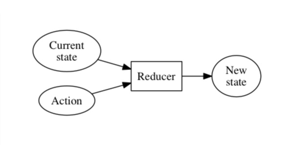

# The Reducer Pattern

Today we'll be learning about reducers, a key concept in functional programming that is at the core of Redux. First, we'll take a step back to learn about data structures in JavaScript and study the idea of *immutable state.*

## Fergalicious definition
A reducer is a pure function that takes the previous state and an action, and returns the next state. It "reduces" those two arguments to one output:



```javascript
reducer = (previousState, action) => nextState
```

Now you may not exactly be *lining down the block* just to learn about this programming construct, but trust me -- reducers are pretty cool! Very helpful for managing state and keeping things organized in larger React apps.

## Review: Data types in JavaScript
In Javascript there are several "primitive types" (e.g., `Number`, `String`, `Boolean`), each of which stores a value of a fixed size in memory. For example, a Number type is always exactly 8 bytes of data, to store a 64-bit floating point value.

Objects, arrays and functions, however, are more advanced data structures and they require a more sophisticated system of memory allocation and management. So an Object actually stores a "pointer" to another memory location, where the right amount of storage space can be dynamically allocated.

`Object` in Javascript is known as a "reference type" because it stores a reference to another memory location rather than storing it directly. Since all non-primitive data structures (including Array and Function) inherit from this same Object prototype in JavaScript, just about every data structure we ever work with in React is stored by reference in memory.

That may feel a bit abstract at first, so here's an example:

```javascript
// Using "=" to copy objects just duplicates the pointer, not the object itself
const josh = {name: "josh", color: "blue"};
const josh_two = josh;
josh_two.color = "red";

console.log(josh, josh_two); // both have color: red
// This invisible mutation leads to unintended side effects! 

// So instead we create a new object every time, like this:
const josh = {name: "josh", color: "blue"};
const josh_two = {...josh, color: "red"};

console.log(josh, josh_two); // different colors
```

## Immutability 
In order to keep state changes and their effects throughtout the application **predictable**, we follow the convention of **immutable state**, creating an entirely new object with every state change. Note how the spread operator `...` helps streamline the syntax for this. Objects in JavaScript are mutable by nature, so we cannot rely on a language feature like `const`. Instead, we enforce immutability as a pattern in the way we write our code. 

We've been following this convention all along, but it becomes especially important in larger applications with more complex and numerous state transitions. Immutable state is one of the core ideas in React, and is necessary for application-level state management with tools like Redux and Context API. 

## Let's make some artisanal ☕️ (with actions and reducers)
Say you're starting a local business, like a coffee shop. Throughout the course of a day there are many different *actions* to be done -- grinding beans, making espresso, accepting payments, and so on. Within a single transaction with a customer, there are several state changes that take place and we'd like them to take place in a specific order. Once the customer pays we'll "dispatch" an action to update the state of their order and kick off the process of making their coffee. Here's an example, to help us get comfortable with the language of reducers:

* Initial state: `{order: '', cost: null, status: 'ordering'}`
* Customer orders. Dispatch action `'PLACE_ORDER'` with payload `'oat milk macchiato'`
* State updated. New state: `{order: 'oat milk macchiato', cost: 3.50, status: 'ordered'}`
* Dispatch action `'ACCEPT_PAYMENT'`
* State updated. New state: `{order: 'oat milk macchiato', cost: 3.50, status: 'paid'}`
* Dispatch action `'PREPARE_COFFEE'`
* State updated. New state: `{order: 'oat milk macchiato', cost: 3.50, status: 'preparing'}`
* making coffee, wait and listen to coffee shop music...
* State updated. New state: `{order: 'oat milk macchiato', cost: 3.50, status: 'complete'}`
* Dispatch action `'SERVE_COFFEE'`

Even in this coffee example, you can imagine how things get complicated quickly. `'PREPARE_COFFEE'` is a simplification of what would actually be many separate actions like `'GRIND_BEANS'`, `'BREW_ESPRESSO'` and `'FROTH_MILK'`. For a small menu we could easily have 20+ different actions, with a specific order of oprations where some actions can be multitasked while other actions can only be started once others complete. 

Rather than hiring a new employee for each action, we choose to hire a skilled barista who can juggle all of these different tasks and keep things organized in an efficient process.

Likewise, in React, we don't need to write a separate function for every possible state transition. Instead, a **reducer** can play the role of barista and handle all of these actions in an organized, predictable way. 

## Reducers in React
So we've learned that a reducer basically handles several functions (now called "actions") in an efficient way. In a React context, reducers are very helopful for state management, since we can write a single reducer that does the work of several different state management functions, all wrapped into one. 

Here are the three main aspects of the pattern:
* **Reducer**: takes an action and current state, returns the new state
* **Action**: object that includes a string specifying the type of action to be performed, and any data needed by the reducer to properly update state (e.g., the text inputted by a user in a form)
* **Dispatch function**: *dispatches* an action to the reducer

An "action" sounds like it should be a function, but in the reducer pattern an action is simply an object with this format:
```javascript
const action = {
  type: 'TAKE_ORDER' // action types are UPPER_CASE string constants by convention
  payload: 'oat milk macchiato' // data needed to update state
}
```

## useReducer Hook
We can start getting comfortable with the Reducer pattern and all of its conventions by working with the `useReducer` hook, an alternative to `useState`:

```javascript
  const [state, dispatch] = useReducer(reducer, initialState);
```

Here's how it works, with a simplified version of our coffee example:

```javascript
// A coffee shop with useReducer:
function reducer(state, action) {
  switch (action.type) {
    case 'TAKE_ORDER':
      return {...state, order: action.payload, status: 'ordered'}; 
      // We'd also lookup the order cost and assign it here
    case 'ACCEPT_PAYMENT':
      return {...state, status: paid};
    // other actions
    default:
      throw new Error();
  }
}

// Component example with dispatch
function Menu() {
  const intialState = {order: '', cost: null, status: 'ordering'};
  const [state, dispatch] = useReducer(reducer, initialState);
  return (
    <>
      <h1>Central Perk Menu</h1>
      <button onClick={() => dispatch({type: 'TAKE_ORDER', payload: 'macchiato'})}>Macchiato</button>
      <button onClick={() => dispatch({type: 'TAKE_ORDER', payload: 'espresso'})}>Espresso</button>
      {/* more menu items */}
    </>
  );
}
```

Redux builds on this pattern to provide a "predictable state container", and over the next two weeks we'll be learning about various ways of managing application-level and context-level state with Redux and Context API. Things can get confusing with the amount of abstraction involved, but as long as you're really solid on these fundamentals you'll be good to go!

## Videos:
* [Codevolution - Reducers with cake shop example](https://www.youtube.com/watch?v=qdAThMLtF98&list=PLC3y8-rFHvwheJHvseC3I0HuYI2f46oAK&index=6)

## Helpful Articles & Docs:
* [Immutability Guide](https://daveceddia.com/react-redux-immutability-guide/)
* [useReducer vs useState](https://www.robinwieruch.de/react-usereducer-vs-usestate)
* [useReducer Hook](https://reactjs.org/docs/hooks-reference.html#usereducer)
* [The Reducer Pattern - notion](https://www.notion.so/The-Reducer-Pattern-a779a5bb46e14882b5ae7d130185931b)
* [Reducers, from the Redux Docs](https://redux.js.org/basics/reducers)
* [JavaScript data types - MDN](https://developer.mozilla.org/en-US/docs/Web/JavaScript/Data_structures)
* [Primitive vs Reference Values](https://www.javascripttutorial.net/javascript-primitive-vs-reference-values/)
