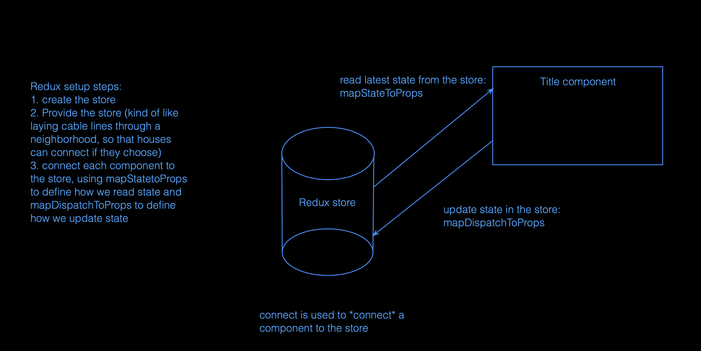

# Redux

## Review: Reducers
In the context of React and state management, a reducer is a pure function that takes the previous state and an action, and returns the next state:
```javascript
reducer = (previousState, action) => nextState
```

Here are the three main aspects of the reducer pattern:
* **Reducer**: takes an action and current state (both objects!) and returns the new state
* **Action**: object that includes a string specifying the type of action to be performed, and any data needed by the reducer to properly update state (e.g., the text inputted by a user in a form)
* **Dispatch function**: *dispatches* an action to the reducer

## Review: Higher Order Components
A higher-order component (HOC) is a function that takes a component and returns a new component:
```javascript
const EnhancedComponent = higherOrderComponent(WrappedComponent);
```

In the context of Redux, we'll be using this pattern with the `connect` function in order to "enhance" the components of our application with the ability to read values from the Redux store and dispatch actions to update the store.

## Managing shared state across multiple components
Without a state management system like Redux, our only notion of state is at the level of each component and all interactions must be achieved with “prop drilling”, passing data and state management functions down the component tree. Redux is all about consolidating this and managing **application-level state**.

We can still work with `useState` for managing state at the component level, but for bigger-picture concerns of our application we'll make the Redux store our single source of truth. 

## The Redux architecture
1. Store - holds the state of your application
2. Action - describes the changes in the state of the application
3. Reducer - actually carries out the state transition depending on the action

Redux uses a strict **unidirectional data flow** to keep everything organized:


## 3 principles of Redux
1. Single source of truth: Redux manages the global state of your application within a single store
2. State is read-only: The only way to change the state is to emit an action
3. To describe how the state tree is transformed by actions, we write pure reducers.

## Actions and action creators
An action is simply an object with this format:
```javascript
const action = {
  type: 'UPDATE_TITLE' // action types are UPPER_CASE string constants by convention
  payload: 'New Title' // data needed to update state
}
```

In Redux, we take the pattern one step further by defining functions called *action creators*. These are exactly what they sound like, and their only purpose is to simply return an action.
```javascript
// updateTitle action creator
export const updateTitle = newTitle => {
  return { type: "UPDATE_TITLE", payload: newTitle };
};
```

## Communicating with the Redux store: `connect`
Since we've learned the reducer pattern, we already understand the fundamentals of Redux. The Redux store is just a "state container" that stores application state and uses reducers to update state in a predictable way.

So how do we interact with the store from our React components? We wrap our application with `<Provider>` and then use the `connect` function on each component to make the Redux store available from that component.

`connect` takes two arguments corresponding to the two direction of communication (receiving values from the store, and updating it). Here's what they mean:
* `mapStateToProps`: which parts of application-level state are relevant to you (the component)? Let me (Redux) know and I'll keep you up to date, sending over those values directly as props whenever the store is updated.
* `mapDispatchToProps`: in what specific ways would you (the component) like to be able to update the store? List each action here and I'll provide a corresponding function for each one, passed to you as props. When you're looking to update application-level state, just call one of those functions and you're done. I'll handle all the reducer-y stuff for you.

When we **connect** a component to the Redux store, we're providing a helpful interface to be able to update our component with the latest application-level state, and also trigger updates to the application-level state from our component.

The way we actually set things up is a bit complex, but the goals behind this pattern are intuitive. Just remember that the whole idea is for components to be able to communicate with the store, to both read and update application state. Our component receives the most up-to-date values from the store as props, and to update the store we just call functions that are also passed to the component as props.

## Putting it all together

Here's a visual summary showing how we set up Redux and `connect` a component to be able to read state values from the store (`mapStatetoProps`) and also update the store by dispatching reducer actions (`mapDispatchToProps`):



Both of these arguments are functions that return objects:

```javascript
const mapStateToProps = state => {
  // map each value to be read from the store to a prop
  return {
    editing: state.editing,
    title: state.title
  };
};

const mapDispatchToProps = dispatch => {
  // build a dispatching function from each action creator
  return {
    updateTitle: newTitle => dispatch(updateTitle(newTitle)), 
    toggleEditing: () => dispatch(toggleEditing()),
    // other actions here
  };

export default connect(mapStateToProps,mapDispatchToProps)(Title);
```

`connect` is itself a higher order function that *returns* a higher order component, which we then immediately invoke on our Title component in order to "enhance" it. (That's a lot to take in, and if all this functional programming stuff feels like Inception to you, you're not alone. But the "enhancement" we're going for with all this is simply the ability to interact with the store.)

The key idea to remember here is: **we `connect` commponents so that they can communicate with the Redux store.**

Once we've wired up our `<Provider>` and `connect` with all of this boilerplate code, most of the complexity is abstracted away and each component is enhanced with this convenient interface to interact with the store:
* State values relevant to the component get passed in as props (updated with every application state change)
* Functions to update application state also get passed to the component as props. (Each of these functions dispatches a corresponding action to a reducer in order to update the Redux store)

## Some magic behind the scenes: mapDispatchToProps shorthand
In Redux we generally use a slightly different pattern than what we saw with the `useReducer` hook. Rather than dispatching actions directly from our components, we define  *action creators*. Then we use those action creators to define simple functions that our components can call directly in order to update the store. That mapping happens in the second argument to `connect`, `mapDispatchToProps`. 

Thanks to `connect`, we can now just call the function `props.updateTitle` from within our component, and the right action type and payload will be dispatched to the reducer. This pattern of mapping *action creators* to functions with the same name allows React Redux to simplify things one step further, working some magic behind the scenes. Rather than writing all of this:

```javascript
const mapDispatchToProps = dispatch => {
  return {
    updateTitle: newTitle => dispatch(updateTitle(newTitle)), 
    toggleEditing: () => dispatch(toggleEditing())
  };
};
```
We can instead use this "object shorthand" format for `mapDispatchToProps`:

```javascript
// This works exactly the same as the more verbose version above
// ES6 object shorthand for {updateTitle: updateTitle, toggleEditing: toggleEditing}
const mapDispatchToProps = {updateTitle, toggleEditing};
```

(If you're curious: behind the scenes, React Redux calls `bindActionCreators({updateTitle, toggleEditing}, dispatch)` to convert the shorthand object into the full mapping function.) 

We'll almost always just use the shorthand, as it's useful in making `connect` easier to use. But understanding what `mapDispatchToProps` does will help a lot in understanding how Redux works. As you're starting out, try writing it out the long way a few times and then refactoring to the object shorthand. By doing this you'll become really comfortable with `connect` and all of the patterns in play here. 

## Summary / TL;DR
Redux is a predictable state container based on the reducer pattern, and it's often used with React to manage application-level state. To connect our components to the Redux store:
1. Wrap the entire application with a Provider: `<Provider><App/></Provider>`. The Provider component (from react-redux) *provides the store*, allowing every component in the app tree to access the Redux store.
2. Call `connect` on each component that needs to read from and update the store. Most components will need only a small subset of the application state, and many components may not need to use connect at all. We use these two arguments of `connect` to define the interface between the component and the store:
* `mapStateToProps` (read interface): a function that returns an object, mapping specific values from the Redux state object to props that will be passed into the current component 
* `mapDispatchToProps` (write interface): an object containing the relevant *action creators* your component will use to update the store. The true form of `mapDispatchToProps` is in a format similar to `mapStateToProps`, a function that returns an object. But as long as we adhere to the standard pattern with action creators we can use this more convenient object shorthand.

## Helpful Resources
* [Redux Glossary](https://redux.js.org/glossary)
* [Three Principles of Redux](https://redux.js.org/introduction/three-principles)
* [React Redux docs: connect, mapStateToProps, mapDispatchToProps](https://react-redux.js.org/api/connect)
* [Codevolution React Redux tutorial](https://www.youtube.com/playlist?list=PLC3y8-rFHvwheJHvseC3I0HuYI2f46oAK)
* [A Cartoon Intro to Redux](https://code-cartoons.com/a-cartoon-intro-to-redux-3afb775501a6)
