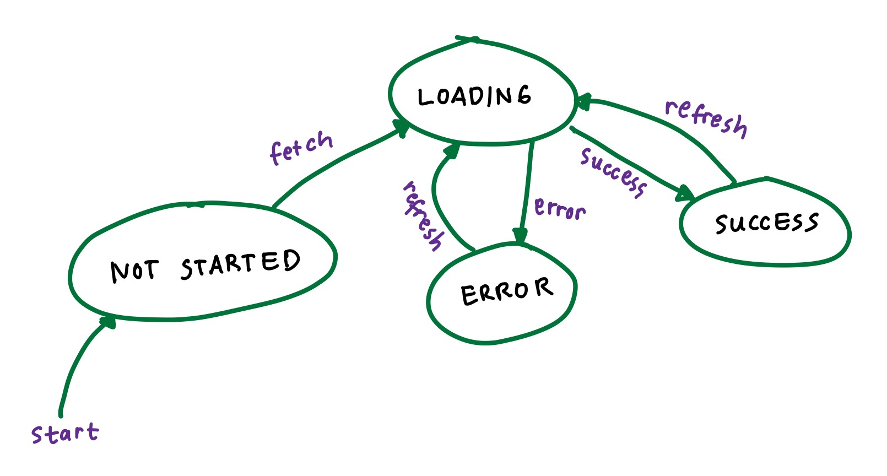

# Async Redux

## Goals
* describe the Finite State Machine pattern and it's relationship to building Redux applications
* implement Redux Middleware libraries into a Redux Store using `applyMiddleware`
* effectively use `redux-thunk` and asynchronous action creators to consume data from external API's
* (new) introduce React Redux hooks, a modern alternative to `connect`

## A visual example
Here's the Redux data flow visualized, with the addition of asynchronous API calls:


## A real-world example ☕️ 
Back to our coffee shop. Let's consider just the step where we actually make the coffee.

### Part 1: let's get thunky
When we dispatch `'MAKE_COFFEE'`, we're actually looking to trigger a sequence of coffee-making actions. We could of course break everything down into individual steps, but all actions in Redux are **synchronous** by default. This means that each step has to complete before the next one starts. But would we really want to just watch the beans grind when we could be getting things done more efficently with some multiasking?

Enter `redux-thunk`, A *middleware* that extends the functionality of Redux, allowing our actions to dispatch actions of their own and introduce more advanced behavior like API calls.

Rather than simply passing an action type and payload to the reducer, we can start multiple processes at once and set up some intelligent multitasking. Start the bean grinder, then steam some milk while the beans grind. Once the beans are ground, then we can start the espresso machine. Once the espresso is brewed and milk frothed, then we can put it all together and serve the drink. All of that work can be divided up in an efficient way, even split among multiple employees and several espresso machines to handle more than one order at once. A production-scale web app may look more like a complex factory than a coffee shop, so this organization and asynchronous behavior becomes essential.

### Part 2: an artisanal oat milk experience
Here's how that `'MAKE_COFFEE'` step might look, as a more complex "asynchronous action" with the newfound power to dispatch actions of its own:
  * Dispatch `'GRIND_BEANS'`
  * Dispatch `'FROTH_MILK'`
  * When bean grinding is complete, dispatch `'BREW_ESPRESSO'`
  * when `'BREW_ESPRESSO'` and `'FROTH_MILK'` are complete, dispatch `'PREPARE_MACCHIATO'`
  * when macchiato is complete, update application state with `status: "complete"`

Note the inherent multitasking involved -- this approach allows optimization and higher customer volume, because no one is stopping to stare while the beans grind :)

### Part 3: 'asynchronous' = multitasking
Note that there's a specific order of operations, with some actions requiring others to complete before they can begin (for example: you need to grind beans before brewing espresso).  *Synchronous* behavior means that all actions take place in sequential order, each waiting for the previous action to complete before starting. *Asynchronous* actions, on the other hand, can take place simultaneously and only wait for others when absolutely necessary. This more nuanced order of operations is essential for any kind of efficient process, and we all do this every day without having to think about it. In software development, this is called *asynchronous / non-blocking* behavior, and it's a **major 🔑** for building fast, responsive applications backed by an API.

This kind of thing is common with asynchronous actions like API calls in React applications -- start the process, go do something else, then come back to handle the response when it's complete.

## API-backed React app as a state machine


When making calls to an API from our React app with Redux, we can use the finite state machine concept (traffic light, locking door, etc) as a mental model for how we think about state changes in the application. In the diagram above, each bubble coresponds to a specific state which we could model with state variables like `loading: boolean` and  `error: string`. Each arrow represents a state change, achieved by dispatching an action to the reducer. Here are some typical actions that we might dispatch as part of an API call:
* FETCHING_START ("refresh" and "fetch" arrows above)
* FETCHING_SUCCESS ("success" arrow above)
* FETCHING_FAILURE ("failure" arrow above)

If you're curious how this is done in larger, more complex applications, feel free to check out options like RxJS and redux-saga. For our purposes here we'll be focusing on one of the simplest approaches, Redux with thunk middleware. 

## Redux Middleware
In the context of Redux, middleware is a way to extend the standard functionality with additional behavior, Middleware provides a third-party extension point after an action is disaptched, before it reaches the reducer:

Dispatching an action
->
middleware
->
Action reaching the reducer

Redux middleware is often used for logging, crash reporting, talking to an asynchronous API, routing, and more. `redux-logger` and `redux-thunk` are common examples of middleware used with Redux.

To apply middleware, Redux provides a function called, of course, `applyMiddleware`. Here's how we use it:

```javascript
const logger = reduxLogger.createLogger();
const store = createStore(rootReducer, applyMiddleware(logger));
```

## Putting it all together: Redux + redux-thunk middleware + asynchronous actions
In Redux, our reducers are *synchronous* by default. If we need to perform asynchronous operations, they need to happen before the actions reach the reducers. So this is why we use middleware to handle asynchronous requests. 

"Thunk" is a name for a function that’s returned by another function. In Redux, actions are normally just objects, but Redux-thunk allows us to return functions instead of objects from our action creators, enabling more dynamic behavior. Then those functions can handle side effects like api calls, and also return regular actions to be handled by the reducer.

Here's a typical setup:
* Use redux-thunk as a middleware, and define async action creators
* Within those async actions, use axios to make requests to an api endpoint

## React Redux Hooks (an alternative to `connect`)
React Redux has been updated to include a simpler approach to connect components to the Redux store: hooks! Just like React Router includes the `useParams` and `useHistory` custom hooks as modern upgrades over the older way of doing things, the React Redux library has joined the hooks party. With the newer hooks syntax, every action creator is basically a "dispatching function" like the ones you write in a longform `mapDispatchToProps` (or the ones generated by `bindActionCreators` if you write the shortform version). With dispatch available in that scope, everything is just a bit more clear to understand at a glance, and the functionality we've achieved here with thunk is already built-in with no need for middleware!

Here's a quick rundown: 
* `useSelector` 👀 to read state values from the Redux store (similar to `mapStateToProps`) 
* `useDispatch` 🚀 to update the store (similar to `mapDispatchToProps`).

As of 2021, `connect` is still widely used but hooks are now recommended as the default approach. Learning both is a great way to deepen your knowledge! Just like class components and function components, you'll be likely to encounter both at some point in your journey. Remember that all these different approaches really just amount to different syntax, so don't worry about the details too much. The functionality is the same, and the most useful thing to focus on at this stage is building a strong understanding of the underlying concepts.

From the React Redux docs: 
> We recommend using the React-Redux hooks API as the default approach in your React components. The existing connect API still works and will continue to be supported, but the hooks API is simpler and works better with TypeScript.

## More Resources
### Videos
* [Codevolution - Redux Thunk Middleware](https://www.youtube.com/watch?v=z2XCUu2wIl0)
### Articles
* [Handling Asynchronous Actions in Redux](https://medium.com/better-programming/handling-asynchronous-actions-in-redux-86724ed87c6c)
* [Redux by TL Megan Miller](https://www.notion.so/Redux-3ac5db784a1e4a1dbe9ecc7c15bbd9fd)
* [Redux applyMiddleware docs](https://redux.js.org/api/applymiddleware)
* [What is a thunk?](https://daveceddia.com/what-is-a-thunk/)
* [Redux-thunk](https://github.com/reduxjs/redux-thunk)
### React Redux hooks articles
* [React Redux docs - hooks API](https://react-redux.js.org/api/hooks)
* [Using Redux with React Hooks](https://thoughtbot.com/blog/using-redux-with-react-hooks)
