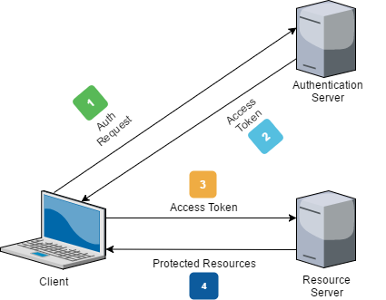

# Client-Side Authentication

## Objectives
After today's guided project, you'll know how to:
* Handle authentication with tokens in a React app
* Implement protected routes using an authentication token and Redirect

## JSON Web Tokens and Auth
Visuals first :) here's what we're learning about today:



Thanks Mark Macneil for this diagram! In our case, there's just one server (rather than separate auth and database servers) but the concept is the same. Here's a typical auth flow, in words:
1. Client app (our front-end React app, running "client-side" in the browser) makes a request to the login endpoint on a web server, sending username and password
2. If successful, the server responds with a token, which the client app saves locally in the browser (localStorage, cookies, etc)
3. When making a request to a "protected" (login required) endpoint, our client app includes this token as an authorization header for every axios request.

Some version of this pattern is used in virtually every web application and mobile app in existence today. If you've ever wondered how you're able to "stay logged in" to websites and mobile apps (all of which consume external API's), this is the answer. And more specifically, this is all achieved using JSON Web Tokens. 

For our purposes, we can simply think of a JSON web token (or JWT for short, pronounced “jot”) as a credential format, used for transferring information securely between a client app and a web server. Check out [jwt.io](https://jwt.io/) for more info if you're curious about the specifics.

## Review: Local Storage
For your Auth Friends project, you'll be using an auth token to make requests to protected API endpoints. After initial authentication, saving the returned auth token locally is a common practice for allowing the user to remain "logged in." We'll use Local Storage for this, since it provides a very straightforward way of saving key/value pairs locally in the browser. Here's a quick review:

```javascript
localStorage.setItem('key', 'value');
localStorage.getItem('key'); // returns 'value
```

Along with `localStorage.removeItem` and `localStorage.clear()` for cleanup, that's basically the entire API! Nice and simple. Note that there are other, more secure methods of saving JWT auth tokens locally and `localStorage` is rarely a good choice for storing auth tokens in production applications. The functionality is pretty similar though, so the localStorage approach provides a good introduction for learning client-side auth.

## API review: HTTP and RESTful services
Since you'll also be working directly with an API for the Auth Friends project, here's a quick review / cheat sheet for how to interact with web services. Most modern API's conform to the "representational state transfer" (REST) architecture.

| HTTP Verb (axios) | CRUD naming      | Description                         | Happy Path                   |
|-------------------|------------------|-------------------------------------|------------------------------|
| get               | Read             | Read a representation of a resource | 200 (OK)                     |
| post              | Create           | Create new resources                | 201 (created)                |
| put               | Update           | Update a resource                   | 200 (OK) or 201 (created)    |
| delete            | Delete           | Delete a resource                   | 200 (OK) or 204 (no content) |

To make debugging easier as you're building out your web client, log any errors to the console from your axios requests. You can always just Google the error codes and messages that show up, but knowing the common ones will make your life a lot easier! Here are some good ones to know:

* **400 Bad Request:** you sent an invalid JSON document (e.g. a "}" is missing), or the syntax/content is incorrect.

* **401 Unauthorized:** the access credentials (via the Authorization header) were missing or are invalid.

* **403 Forbidden:** the credentials you provided are valid, but you are not authorized to access the resource you requested.

* **404 Not found:** the request itself is valid, but the resource you try to access does not exist, or is outside your scope.


## Videos
* [Protected Routes in React using React Router](https://www.youtube.com/watch?v=Y0-qdp-XBJg)
* [React Client Side Authentication](https://www.youtube.com/watch?v=oRL-pttfNSc)

## Articles
* [Introduction to JSON Web Tokens](https://jwt.io/introduction/)
* [Protected Routes - React tutorial](https://medium.com/javascript-in-plain-english/how-to-set-up-protected-routes-in-your-react-application-a3254deda380)
* [Building Basic React Authentication](https://medium.com/better-programming/building-basic-react-authentication-e20a574d5e71)
* [Introduction to Local Storage](https://sebhastian.com/local-storage-introduction)
* [HTTP Verbs and Error Codes](https://developers.evrythng.com/docs/http-verbs-and-error-codes)
