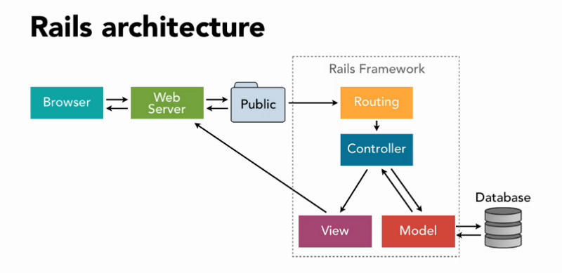

# Deploying Web Apps

## Objectives
After today's guided project, you should be able to:
* explain how the world wide web works
* explain what it means to "deploy" a static web app
* demonstrate the ability to deploy and maintain a React App using Vercel

## Review: Client / Server
Whenever we're writing React apps, these are web applications that run in a browser, "client-side" or "front-end".

"Server-side" code (Node.js, Python, Ruby, Java, etc) is the "back end" application that works with a SQL database and other resources, providing a specific interface for client apps to be able to interface with those resources.

In the case of a single-page React app (SPA), the server delivers that application code to your browser once. From there on out, your browser does a lot of the heavy lifting and the server is pretty much just there to be a data interface. This is similar for mobile apps, which store application code on your device and consumes an external API in the same way for database interaction and other resources.

As you get more familiar with the big picture of how all of these pieces work together, just be sure to keep in mind which pieces of the architecture run in a browser ("client-side" / "front end") and which run on a server ("server-side" / "back end").

## Modern web architecture 

You can visualize this more effectively with bidirectional arrows, but the main idea is that a single API can be standardized to serve a variety of clients, including web apps (like the React apps we've built) as well as mobile (iOS / Android) and even desktop (Mac/PC) apps.

We standardize API's with the help of the REST architecture and communication with JSON. This whole approach isn't exactly new, but it's come into greater popularity over the last decade or so as the Internet has evolved from older "Web 2.0" sites (where a server handles all the logic and delivers each page with a reload) to the current focus on fast, responsive single-page apps. Our phones & computers have become so powerful that they can just handle all of the logic, leaving the server-side API with only the simple task of managing our "cloud" data. 

This architecture is the most popular approach to web development at the moment: client apps (React, iOS, Android and others) truly behave like apps, and handle all database-related behavior through asynchronous API requests.

## The old way ("back in my day, PHP was the hot new thing...")

Note how different this is from a popular way of doing things just 5-10 years ago with MVC (model, view, controller) frameworks like Ruby on Rails:

Older web frameworks like Rails do almost everything server-side and just deliver each page to the client. Originally there was no notion of an "app" on the client side, just some basic click handlers and other interactive features implemented with Javascript. As the desire for highly interactive web apps grew, more and more functionality moved to the client side in order to avoid the lag time of waiting on an external server for every new page. 

This older model is all but archaic now, but it's interesting to know the progression and understand the context of how web development has evolved! MVC frameworks and other similar approaches are still sometimes used for building API's, but the "view" portion is just the JSON response rather than a webpage. 

## Static & Dynamic Web Apps
A "static" application has hardcoded data that doesn’t change. While our React apps use data from third-party libraries and provide a user experience that is anything but "static", they still deploy very much like a static app. Your Javascript code is delivered directly to the browser to run client-side.

There's a lot more setup involved in deploying a database-backed web service, but there are also "Platform as a Service" providers like Heroku that help streamline this kind of deployment just like Vercel helps out with deploying React apps. 

## Deployment with Vercel
Vercel (formerly known as ZEIT) is a cloud platform for static sites that allows developers to deploy instantly and host apps with minimal configuration. Their documentation refers to the "JAMstack", which simply means JavaScript, reusable APIs, and prebuilt Markup.

## Helpful Links
* [Vercel](https://vercel.com/)

Thanks to HappyCoding.io for the REST API & client apps diagram above.
